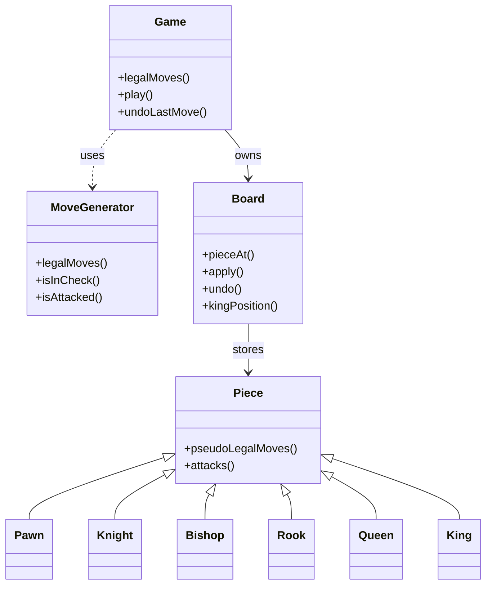
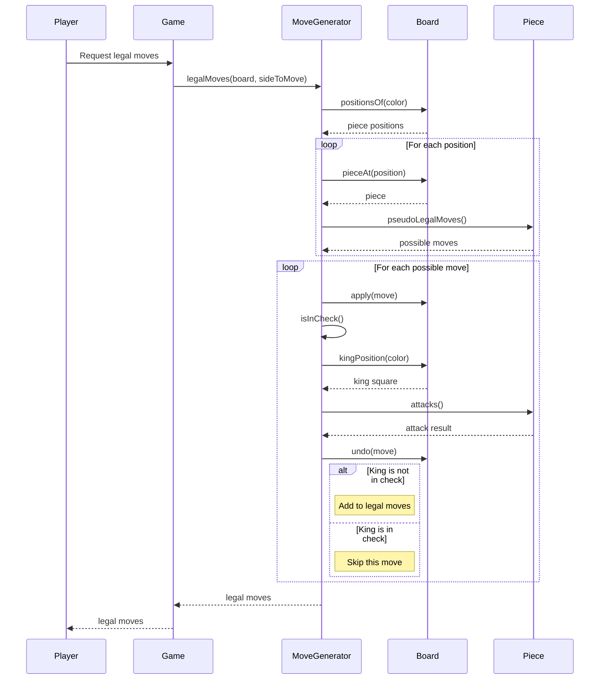

# M5 Chess Engine Design

## Class Diagram

```mermaid
classDiagram
    class Game {
        +legalMoves()
        +play()
        +undoLastMove()
    }

    class MoveGenerator {
        +legalMoves()
        +isInCheck()
        +isAttacked()
    }

    class Board {
        +pieceAt()
        +apply()
        +undo()
        +kingPosition()
    }

    class Piece {
        +pseudoLegalMoves()
        +attacks()
    }

    class Pawn
    class Knight
    class Bishop
    class Rook
    class Queen
    class King

    Game --> Board : owns
    Game ..> MoveGenerator : uses
    Board --> Piece : stores

    Piece <|-- Pawn
    Piece <|-- Knight
    Piece <|-- Bishop
    Piece <|-- Rook
    Piece <|-- Queen
    Piece <|-- King
```

## Sequence Diagram

```mermaid
sequenceDiagram
    participant Player
    participant Game
    participant MoveGenerator
    participant Board
    participant Piece

    Player->>Game: Request legal moves
    Game->>MoveGenerator: legalMoves(board, sideToMove)

    MoveGenerator->>Board: positionsOf(color)
    Board-->>MoveGenerator: piece positions

    loop For each position
        MoveGenerator->>Board: pieceAt(position)
        Board-->>MoveGenerator: piece
        MoveGenerator->>Piece: pseudoLegalMoves()
        Piece-->>MoveGenerator: possible moves
    end

    loop For each possible move
        MoveGenerator->>Board: apply(move)
        MoveGenerator->>MoveGenerator: isInCheck()

        MoveGenerator->>Board: kingPosition(color)
        Board-->>MoveGenerator: king square

        MoveGenerator->>Piece: attacks()
        Piece-->>MoveGenerator: attack result

        MoveGenerator->>Board: undo(move)

        alt King is not in check
            Note right of MoveGenerator: Add to legal moves
        else King is in check
            Note right of MoveGenerator: Skip this move
        end
    end

    MoveGenerator-->>Game: legal moves
    Game-->>Player: legal moves
```